# Vento State Machine

This is a model of the Vento state machine. It's intended for plugin development purposes only.

## Lexing Algorithm
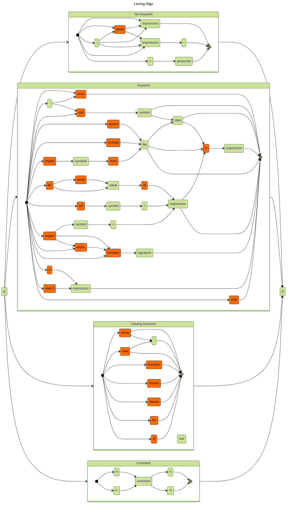
```mermaid
---
title: Lexing Algo
config:
  theme: 'forest'
  themeVariables:
    darkmode: 'false'
    background: '#ffffff'
---
stateDiagram-v2
    direction LR


    keyword:Keyword
    state keyword {
        direction LR

        state "echo" as echo
        state "else if" as elseif
        state "else" as else
        state "export" as export
        state "for" as for
        state "function" as function
        state "if" as if
        state "import" as import
        state "include" as include
        state "layout" as layout
        state "set" as set
        state "slot" as slot
        state "signature" as statement0


        state "data" as data
        state "|>" as pipe
        state "expression" as pipeExp
        state "-" as otrim
        state "expression" as kexp0
        state "=" as eq1
        state "=" as eq2
        state "expression" as exp0
        state "symbol" as symbol
        state "symbol" as symbol2
        state "symbol" as symbol1

        [*] --> echo
        [*] --> otrim
        otrim --> echo

        otrim --> slot
        [*] --> slot
        slot --> symbol2
        symbol2 --> [*]
        symbol2 --> data
        data-->[*]

        [*] --> layout
        layout --> file
        [*] --> include
        include --> file

        file --> data
        file --> pipe
        file --> [*]
        data --> pipe
        pipe --> pipeExp

        [*] --> import
        import --> symbols
        symbols --> from
        from --> file

        [*] --> for
        for --> await
        await --> value
        for --> value
        value --> of
        of --> kexp0
        echo --> [*]
        statement0 --> [*]

        [*] --> set
        set --> symbol1
        symbol1 --> eq1
        eq1 --> kexp0

        kexp0 --> pipe
        kexp0 --> [*]


        [*] --> export
        export --> symbol
        export --> function
        export --> async
        symbol --> eq2
        eq2 --> kexp0

        [*] --> async
        async --> function
        [*] --> function
        function --> statement0

        exp0 --> [*]

        [*] --> if
        if --> exp0
        [*] --> elseif
        elseif --> exp0
        [*] --> else
        else --> [*]

        pipeExp --> [*]


}


    ckeyword: Closing Keyword
    state ckeyword {
        direction LR
        state "/echo" as cecho
        state "/export" as cexport
        state "/for" as cfor
        state "/function" as cfunction
        state "/if" as cif
        state "/layout" as clayout
        state "/set" as cset
        state "/slot" as cslot
        state "-" as cktrim
        [*] --> cecho
        [*] --> cslot
        [*] --> cfunction
        [*] --> cexport
        [*] --> clayout
        [*] --> cfor
        [*] --> cif
        cecho --> cktrim
        cslot --> cktrim
        cecho --> [*]
        cktrim --> [*]
        cslot --> [*]
        cfunction --> [*]
        cexport --> [*]
        clayout --> [*]
        cfor --> [*]
        cif --> [*]
    }


    nokeyword: No Keyword
    state nokeyword {
        direction LR

        state "expression" as exp1
        state "expression" as exp2

        state "javascript" as js
        state ">" as mjs
        state "-" as ontrim
        state "-" as cntrim
        state "await" as await2
        ontrim --> await2
        ontrim --> exp2
        ontrim --> exp1
        [*] --> exp2
        [*] --> await2
        await2--> exp2
        [*] --> ontrim
        [*] --> exp1
        [*] --> mjs
        await2--> exp1
        exp1 --> cntrim

        exp2 --> [*]
        cntrim --> [*]
        js --> [*]
        mjs --> js
    }

    comment:Comment
    state comment {
        direction LR
        state "#" as oc
        state "#-" as oct
        state "#" as cc
        state "-#" as ct
        state "comment" as comment1

        [*] --> oc
        [*] --> oct
        oc --> comment1
        oct --> comment1
        comment1 --> cc
        comment1 --> ct
        cc --> [*]
        ct --> [*]
    }

    state "{{" as open
    state "}}" as close

    open --> nokeyword
    nokeyword --> close

    open --> keyword
    keyword --> close


    open --> ckeyword
    ckeyword --> close

    open --> comment
    comment --> close

    style echo stroke:#000000,fill:#FF6D00,color:#000000
    style function stroke:#000000,fill:#FF6D00,color:#000000
    style import stroke:#000000,fill:#FF6D00,color:#000000
    style from stroke:#000000,fill:#FF6D00,color:#000000
    style export stroke:#000000,fill:#FF6D00,color:#000000
    style layout stroke:#000000,fill:#FF6D00,color:#000000
    style include stroke:#000000,fill:#FF6D00,color:#000000
    style set stroke:#000000,fill:#FF6D00,color:#000000
    style slot stroke:#000000,fill:#FF6D00,color:#000000
    style for stroke:#000000,fill:#FF6D00,color:#000000
    style of stroke:#000000,fill:#FF6D00,color:#000000
    style if stroke:#000000,fill:#FF6D00,color:#000000
    style else stroke:#000000,fill:#FF6D00,color:#000000
    style elseif stroke:#000000,fill:#FF6D00,color:#000000
    style await stroke:#000000,fill:#FF6D00,color:#000000
    style await2 stroke:#000000,fill:#FF6D00,color:#000000
    style async stroke:#000000,fill:#FF6D00,color:#000000
    style pipe stroke:#000000,fill:#FF6D00,color:#000000

    style cecho stroke:#000000,fill:#FF6D00,color:#000000
    style cfunction stroke:#000000,fill:#FF6D00,color:#000000
    style cexport stroke:#000000,fill:#FF6D00,color:#000000
    style clayout stroke:#000000,fill:#FF6D00,color:#000000
    style cslot stroke:#000000,fill:#FF6D00,color:#000000
    style cfor stroke:#000000,fill:#FF6D00,color:#000000
    style cif stroke:#000000,fill:#FF6D00,color:#000000

```

## State Diagram
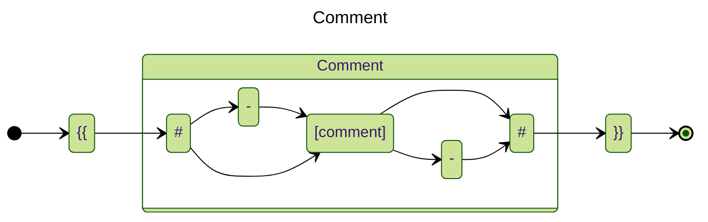
```mermaid
---
title: Comment
config:
  theme: 'forest'
  themeVariables:
    darkmode: 'false'
    background: '#ffffff'
---
stateDiagram-v2
    direction LR
    state "#" as ohash
    state "#" as chash

    state "-" as ocdash
    state "-" as ccdash
    state "[comment]" as comment

    [*] --> open1

    close1 --> [*]

state "{{" as open1
state "}}" as close1
    open1 --> ohash

grComment: Comment
state  grComment {
    ocdash --> comment
    comment --> ccdash

    ohash --> ocdash

    ohash --> comment
    comment --> chash

    ccdash --> chash
}
    chash --> close1

```

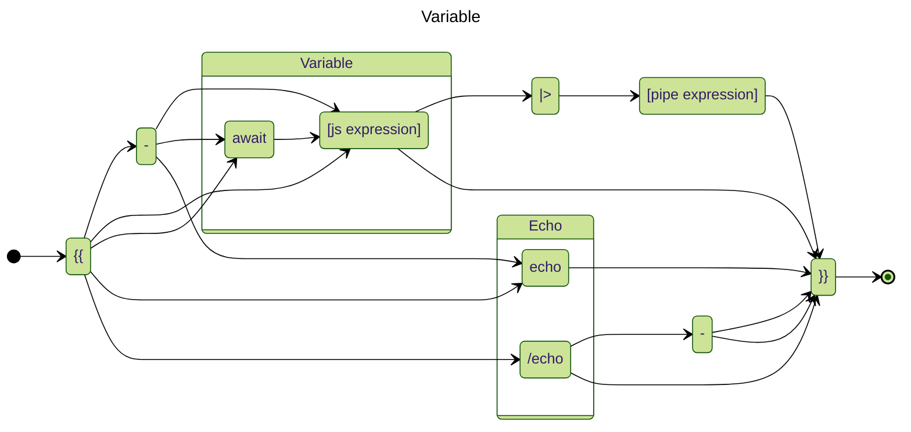
```mermaid
---
title: Variable
config:
  theme: 'forest'
  themeVariables:
    darkmode: 'false'
    background: '#ffffff'
---
stateDiagram-v2
    direction LR

    state "|>" as pipe
    state "[pipe expression]" as pipeExpression

    [*] --> open2

    close2 --> [*]

%% variable
    state "{{" as open2
    state "}}" as close2
    state "-" as odash2
    state "-" as cdash2
    open2 --> odash2
    open2 --> expression
    open2 --> vawait
    odash2 --> expression
    odash2 --> vawait
    vawait --> expression

grVariable: Variable
state  grVariable {
    state "[js expression]" as expression
    state "await" as vawait
}

grEcho: Echo
state  grEcho{
    state "echo" as echo
    state "/echo" as cecho

 }
    expression --> pipe


    pipe --> pipeExpression

    cdash2 --> close2
    expression -->close2
    pipeExpression --> close2

%% echo

    open2 --> echo
    odash2 --> echo
    echo --> close2

    open2 --> cecho
    cecho --> cdash2
    cdash2 --> close2
    cecho --> close2


```

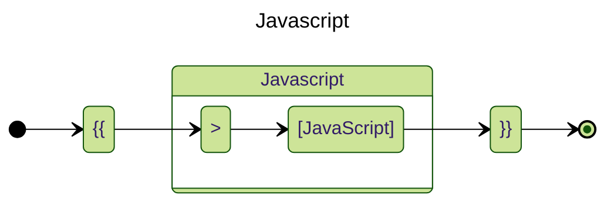
```mermaid
---
title: Javascript
config:
  theme: 'forest'
  themeVariables:
    darkmode: 'false'
    background: '#ffffff'
---
stateDiagram-v2
    direction LR
    state "[JavaScript]" as js

    [*] --> open3

    close3 --> [*]
%% Javascript
    state "{{" as open3
    state "}}" as close3
    open3 --> gt
    grJavaScript: Javascript
state  grJavaScript {
state ">" as gt
    gt --> js
}
    js --> close3


```

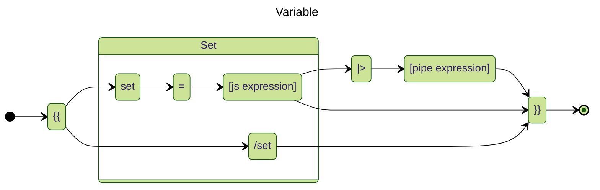
```mermaid
---
title: Variable
config:
  theme: 'forest'
  themeVariables:
    darkmode: 'false'
    background: '#ffffff'
---
stateDiagram-v2
    direction LR

    state "[js expression]" as setexp

    state "set" as set

    state "|>" as pipe
    state "[pipe expression]" as pipeExpression

    state "=" as equals

    [*] --> open8

    close8 --> [*]


%% set
state "{{" as open8
state "}}" as close8
    open8 --> set
grSet : Set
state grSet {
    state "/set" as cset
    set --> equals
    equals --> setexp
}
    setexp --> pipe
    pipe --> pipeExpression
    pipeExpression --> close8
    setexp --> close8

    open8 --> cset
    cset --> close8


```

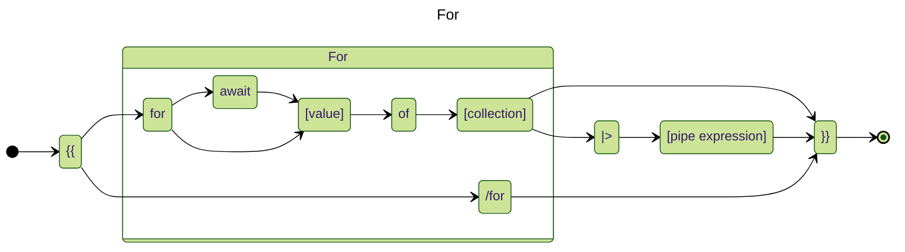
```mermaid
---
title: For
config:
  theme: 'forest'
  themeVariables:
    darkmode: 'false'
    background: '#ffffff'
---
stateDiagram-v2
    direction LR

    state "|>" as pipe
    state "[pipe expression]" as pipeExpression

    state "[value]" as forValue
    state "of" as of
    state "[collection]" as collection

    [*] --> open9

    close9 --> [*]

%% for
state "{{" as open9
state "}}" as close9
    open9 --> for
grFor: For
state grFor {
    state "/for" as cfor
    for --> await
    await --> forValue
    for --> forValue
    forValue --> of
    of --> collection
}
    collection --> close9
    collection --> pipe
    pipe --> pipeExpression
    pipeExpression --> close9

    open9 --> cfor
    cfor --> close9


```

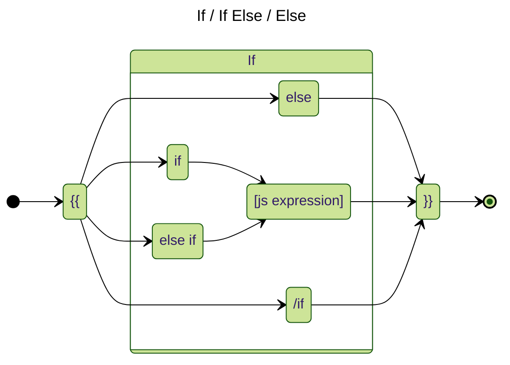
```mermaid
---
title: If /  If Else / Else
config:
  theme: 'forest'
  themeVariables:
    darkmode: 'false'
    background: '#ffffff'
---
stateDiagram-v2
    direction LR


    [*] --> open6

    close6 --> [*]

    state "[js expression]" as ifexp
%% if
    state "{{" as open6
    state "}}" as close6
    open6 --> if
grIf: If
state grIf {
    state "if" as if
    state "else" as else
    state "else if" as elseif
    state "/if" as cif
    if --> ifexp
    elseif --> ifexp
}
    open6 --> elseif

    open6 --> else
    else --> close6


    ifexp --> close6
    open6 --> cif
    cif --> close6


```

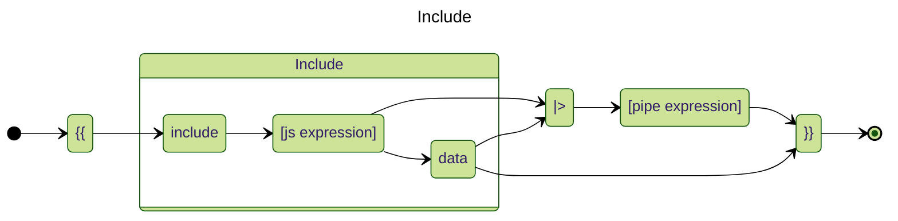
```mermaid
---
title: Include
config:
  theme: 'forest'
  themeVariables:
    darkmode: 'false'
    background: '#ffffff'
---
stateDiagram-v2
    direction LR
    state "{{" as open
    state "}}" as close
    state "[js expression]" as includeexp
    state "include" as include

    state "|>" as pipe
    state "[pipe expression]" as pipeExpression

    [*] --> open
    close --> [*]

%% include

    open --> include
    grInclude: Include
state  grInclude {
    include --> includeexp
    includeexp --> data
    }
    includeexp --> pipe
    pipe --> pipeExpression
    pipeExpression --> close
    data --> pipe
    data --> close

```

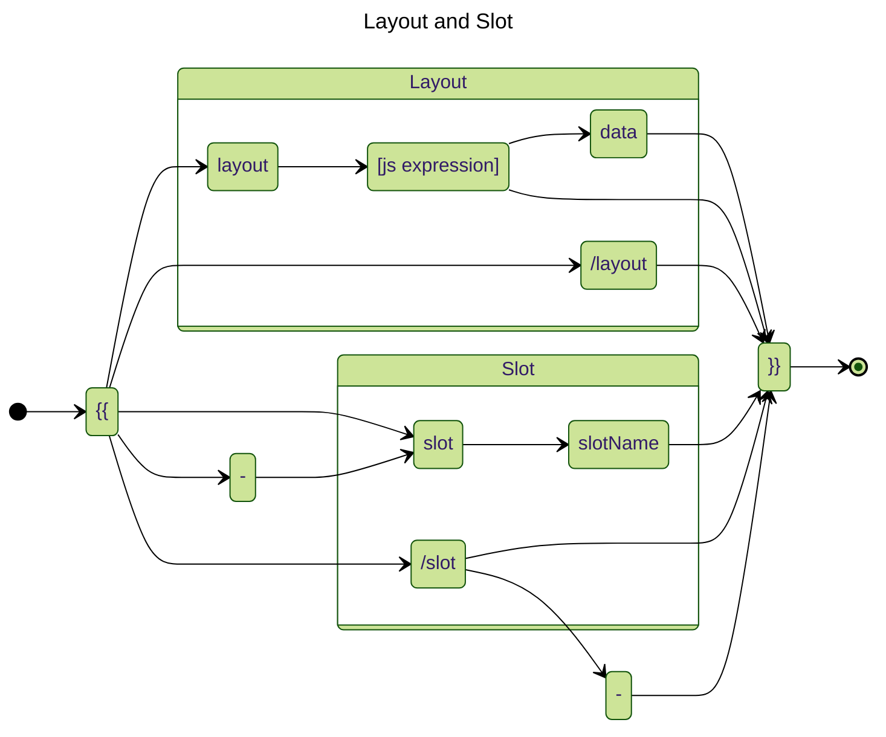
```mermaid
---
title: Layout and Slot
config:
  theme: 'forest'
  themeVariables:
    darkmode: 'false'
    background: '#ffffff'
---
stateDiagram-v2
    direction LR

    state "[js expression]" as layoutexp
    state "layout" as layout

    [*] --> open7

    close7 --> [*]

%% layout
    state "{{" as open7
    state "}}" as close7
    state "-" as odash7
    state "-" as cdash7
    open7 --> layout
    grLayout: Layout
state grLayout {
    state "/layout" as clayout
    layout --> layoutexp
    layoutexp --> data
}
    data --> close7
    layoutexp --> close7

    open7 --> clayout
    clayout --> close7
grSlot: Slot
state grSlot {
    state "/slot" as cslot
    state "slot" as slot
    slot --> slotName


 }
    open7 --> slot
    open7 --> odash7
    odash7 --> slot


    slotName --> close7

    open7 --> cslot
    cslot --> close7
    cslot --> cdash7
    cdash7 --> close7


```

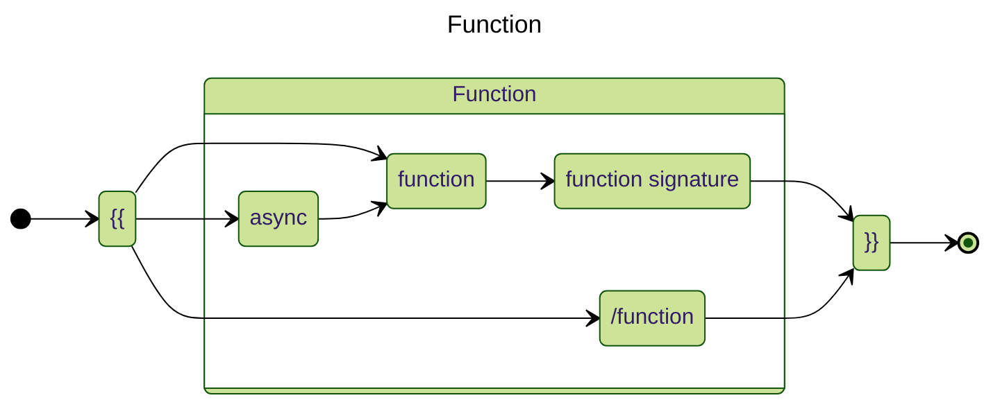
```mermaid
---
title: Function
config:
  theme: 'forest'
  themeVariables:
    darkmode: 'false'
    background: '#ffffff'
---
stateDiagram-v2
    direction LR
    state "{{" as open
    state "}}" as close
    state "function" as function
    state "function signature" as functionSignature

    [*] --> open
    close --> [*]

%% function
    open --> function
    open --> async
    grFunction: Function
state grFunction {
    state "/function" as cfunction
    async --> function
    function --> functionSignature
    }
    functionSignature --> close

    open --> cfunction
    cfunction --> close

```

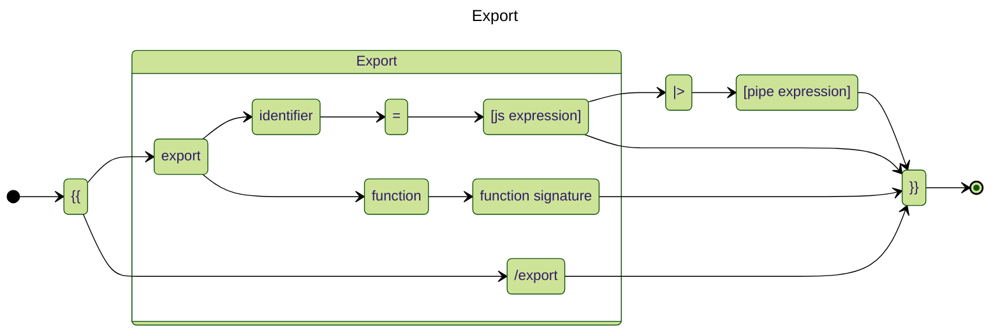
```mermaid
---
title: Export
config:
  theme: 'forest'
  themeVariables:
    darkmode: 'false'
    background: '#ffffff'
---
stateDiagram-v2
    direction LR

    state "[js expression]" as exportexp
    state "function" as exportfunction
    state "function signature" as exportfunctionSignature
    state "export" as export
%%

    state "|>" as pipe
    state "[pipe expression]" as pipeExpression

    state "=" as equals


    [*] --> open5

    close5 --> [*]

%% export
state "{{" as open5
state "}}" as close5

    open5 --> export
    grExport: Export
    state  grExport {
        state "/export" as cexport
        export --> identifier
        identifier --> equals
        equals --> exportexp
        export --> exportfunction
        exportfunction --> exportfunctionSignature
    }
    exportexp --> pipe
    pipe --> pipeExpression
    pipeExpression --> close5
    exportexp --> close5

    exportfunctionSignature --> close5

    open5 --> cexport
    cexport --> close5

```

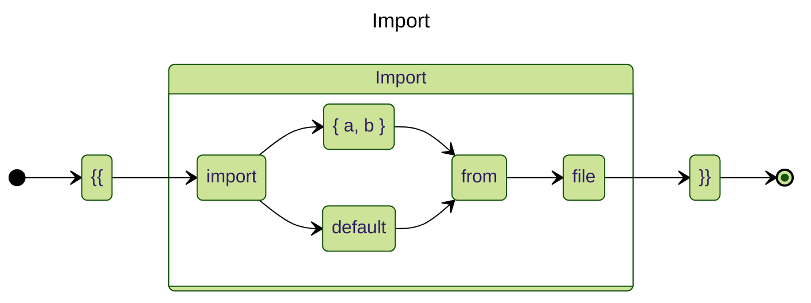
```mermaid
---
title: Import
config:
  theme: 'forest'
  themeVariables:
    darkmode: 'false'
    background: '#ffffff'
---
stateDiagram-v2
    direction LR


    state "{ a, b }" as destructimport
    state "default" as defaultimport
    state "from" as from


    state "import" as import


    [*] --> open4

    close4 --> [*]

%% import
state "{{" as open4
state "}}" as close4
    open4 --> import
    grImport: Import
state grImport {
    import --> destructimport
    destructimport --> from
    import --> defaultimport
    defaultimport --> from
    from --> file
    }
    file --> close4


```
