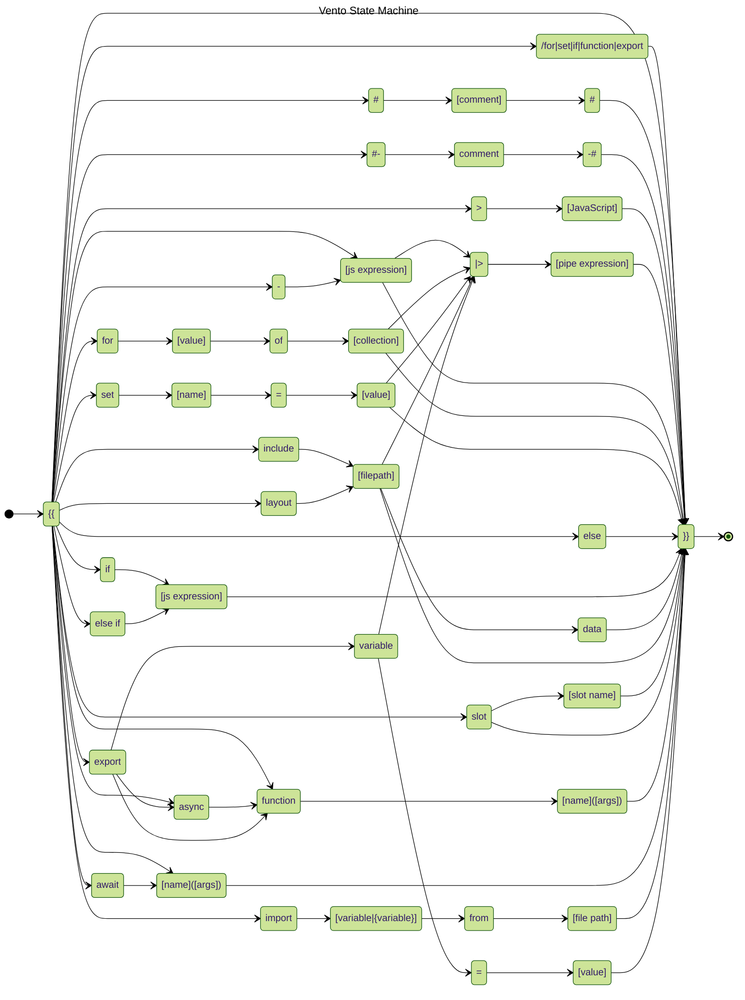

# Vento State Machine

This is a model of the Vento state machine. It's intended for plugin development purposes only.

## State Diagram

## Vento clause

- `{{`
- `}}`

## Vento Clause Prefix

- `for`
- `set`
- `include`
- layout
  - `layout "[file path]"`
- set
  - `set [name] = [value]`
- slot
    - `slot`
    - `slot name`
- if
    - `if`
    - `else`
    - `else if`
- comments
  - `#` - comment
  - `#-` - trimmed comment
- JavaScript
  - ` ` - JS expression
  - `-` - Trimmed JS expression
  - `>` - JS block

## Vento Expression suffix

- `#`
- `-#`

## Vento closing tags

- `/for`
- `/set`
- `/if`
- `/function`
- `/export`

## JS Clauses

- `[js expression]`
- `[name]([args])`
- for
  - `[value] of [collection]`
- export
  - `[variable]`
  - `async function [name]([args])`
  - `function [name]([args])`
  - `function [name]`
- function
  - `[name]([args])`
  - `[name]`
  - `async function [name]([args])`
  - `async function [name]`
  - `await [name]([args])`
  - `await [name]`
- import
  - `[variable] from "[file path]"`
  - `{[variable]} from "[file path]"`

## Vento Pipe suffix

- `|> [pipe expression]`
